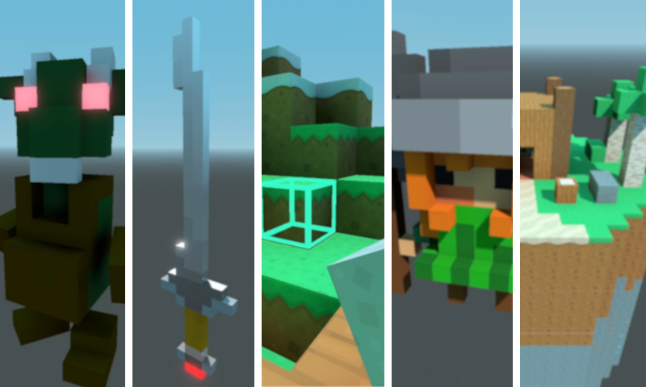
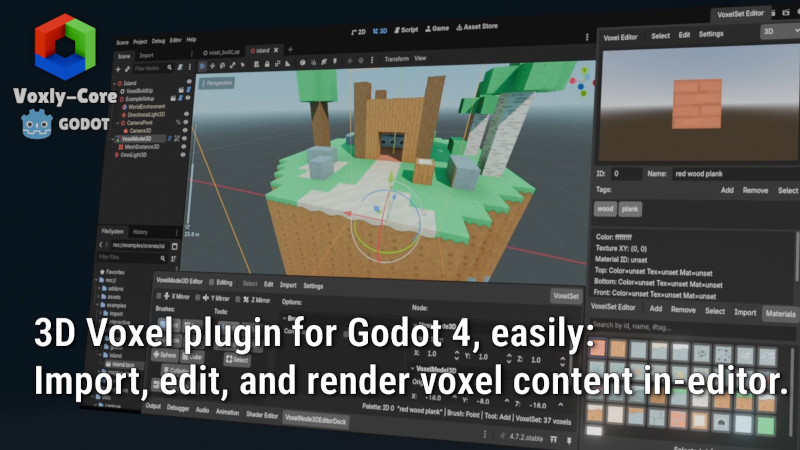
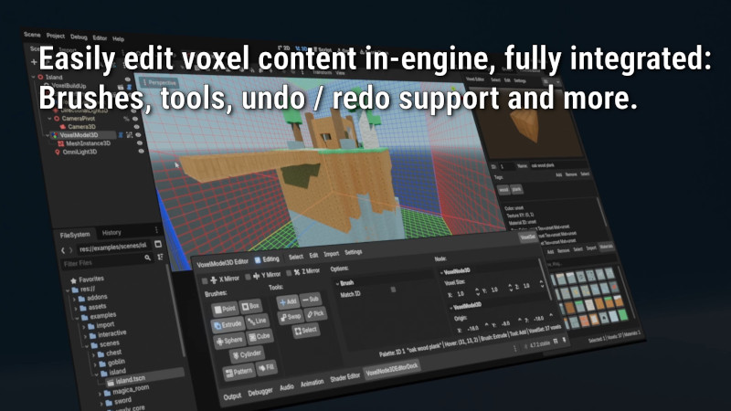
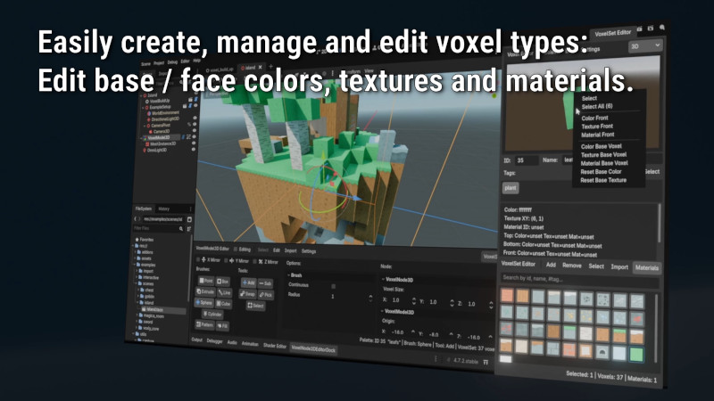
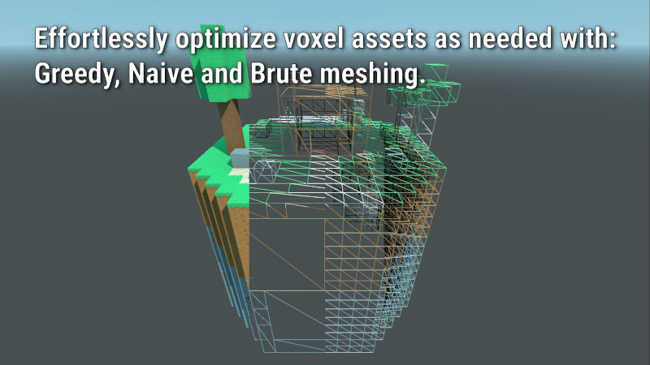

<p align="center">
	
	<h1 align="center">
		Voxly-Core
		<p align="center">
			<a href="https://github.com/ClarkThyLord/Voxly-Core/releases">
				
			</a>
			<a href="https://github.com/ClarkThyLord/Voxly-Core/blob/master/LICENSE">
				
			</a>
		</p>
	</h1>
</p>

> 3D Voxel plugin for Godot 4: Import, edit, and render voxel content all in-editor.


<p align="center">
	
</p>

---

- [✨ Features (YouTube Video)](#-features-youtube-video)
- [🚀 Installation](#-installation)
	- [Installation Method 1: Godot Asset Store (Recommended)](#installation-method-1-godot-asset-store-recommended)
	- [Installation Method 2: Manual Installation](#installation-method-2-manual-installation)
	- [Activating the Plugin](#activating-the-plugin)
- [🐛 Reporting Bugs](#-reporting-bugs)
- [🤝 Contributing](#-contributing)


# ✨ Features ([YouTube Video](https://youtu.be/SnAxYirhpSY))

<p align="center">
	
</p>

> Easily edit voxel content in-engine, fully integrated brushes, tools, undo / redo support and more.

<p align="center">
	
</p>

> Create, import and edit custom voxel content easily with in-editor docks or programmatically.

<p align="center">
	
</p>

> Interactively edit voxels in-engine; all while being able to modify base / face colors, textures, and materials.

<p align="center">
	
</p>

> Create dynamic voxel content or static optimized meshes to reuse as needed.

# 🚀 Installation

## Installation Method 1: Godot Asset Store (Recommended)

> For those looking to use the Voxly-Core plugin in their Godot 4.7+ project.

1. Open your project in the Godot Engine.
2. Click on the Asset Store tab.
3. Use the search bar to find "Voxly-Core".
4. Click on the asset version you want, then click "Download".
5. Once downloaded, an Install window will pop up. You can check or uncheck specific files, then click "Install" to add them directly to your project's files.


## Installation Method 2: Manual Installation

> For those looking to use the Voxly-Core plugin in their Godot <4.6 project, or looking to contribute and / or want to take a look at examples.

1. Open your terminal, navigate to your Godot project's root directory, and clone this repository:
	```bash
	git clone https://github.com/ClarkThyLord/voxly-core
	```
2. You can now import `voxly-core` project into Godot, once imported you may browse examples and code.
3. *Install just plugin:* Move or copy the plugin folder into your project's `addons/` directory:
	* **Windows:**
		```cmd
		xcopy /E /I "voxly-core/addons/voxly-core" "addons/voxly-core"
		```
	* **MacOS / Linux:**
		```bash
		mkdir -p addons && cp -r voxly-core/addons/voxly-core addons/
		```
4. *Optional:* You can now safely delete the cloned `voxly-core` folder from your disk, as your project only needs the files copied into `addons/`.

## Activating the Plugin

Once the files are in your project folder, you must tell Godot to run it:

1. Open or reload your project in the **Godot Editor**.
2. Navigate to **Project** > **Project Settings** at the top menu.
3. Click on the **Plugins** tab.
4. Locate **Voxly-Core** and check the **Enable** box.

# 🐛 Reporting Bugs

Before opening a new issue, please search the existing issues to see if someone else has already reported it!
Otherwise, if you found a new bug or something isn't working as expected, please report it!

To open a bug report:
1. Go to the [Issues Tab](https://github.com/ClarkThyLord/voxly-core/issues) of this repository.
2. Click the green **New Issue** button.
3. Add corresponding **Labels**, if any applicable.

To help fix the issue, please include:
* **A clear title:** Summarize the problem concisely.
* **Steps to reproduce:** Detail exactly how to trigger the bug.
* **Expected vs. actual behavior:** What should have happened, and what actually happened.
* **Environment details:** Your OS version, Godot version and plugin version.
* **Screenshots or error logs:** If applicable, paste them into the issue description.


# 🤝 Contributing

Anyone is welcome to contribute!
Just follow the following before you do:

1. Fork the repository and create a branch for your changes.
2. Make sure your changes are consistent with codebase and commit them cleanly.
	- Comment code as needed, following [GDScript Documentation Comments](https://docs.godotengine.org/en/stable/tutorials/scripting/gdscript/gdscript_documentation_comments.html)
	- Adhere to code guidelines, following [GDScript Style Guide](https://docs.godotengine.org/en/stable/tutorials/scripting/gdscript/gdscript_styleguide.html)
3. Squash your commits, such that work-in-progress commits are "hidden".
	* **Squash git command:**
		```bash
		git rebase -i HEAD~n
		```
4. Push changes to your fork, and once ready open a Pull Request.
